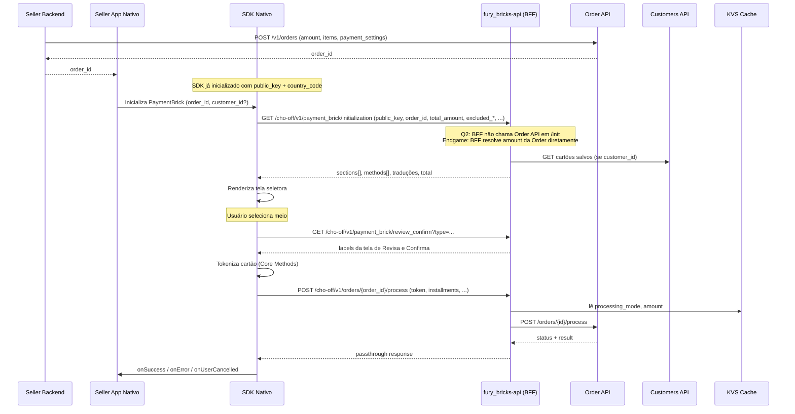

# PaymentBrick Nativo — Selector de Meios — Technical Spec

**Status**: approved
**Owner**: Danielle Ogawa
**Jira**: [SMFINTECH-32897](https://mercadolibre.atlassian.net/browse/SMFINTECH-32897)
**RFC**: [[RFC] PaymentBrick MLA](https://grid.adminml.com/d/01KRE8MW8TVD33X6FDMP0W733W/view)
**Functional Spec**: [1-functional/spec.md](../1-functional/spec.md)
**Created**: 2026-05-22
**Last Updated**: 2026-07-07T00:00:00Z

> **Payment Flows**: Decisões de design e telas dos fluxos de pagamento foram extraídas para spec dedicada → [`003-payment-flows/2-technical/spec.md`](../003-payment-flows/2-technical/spec.md)

> **CVV Screen**: Tudo relacionado à tela de CVV foi extraído para spec dedicada → [`002-cvv-screen/2-technical/spec.md`](../002-cvv-screen/2-technical/spec.md)

> **Revisa e Confirma**: DD-2, contrato do `GET /review_confirm` e tracking events foram extraídos para spec dedicada → [`20260622-payment-review-confirm/2-technical/spec.md`](../../20260622-payment-review-confirm/2-technical/spec.md)

---

## Executive Summary

O PaymentBrick Nativo é uma feature multi-repositório que entrega um SDK de checkout (Android + iOS) integrado a um BFF dedicado em Go. A arquitetura opera no modelo **Order Builder Mode**: o seller cria a Order com `payment_settings` server-side, incluindo `processing_mode`. Em Q2.26, o SDK envia `amount` na inicialização; o `processing_mode` não é enviado pelo SDK — o BFF usa `aggregator` hardcoded internamente, pois o valor já está na Order. O BFF valida o `amount` contra a Order no `/process`, prevenindo fraudes. O endgame (BFF resolvendo ambos diretamente da Order API) é planejado para entregas futuras.

Três novos endpoints REST são adicionados ao BFF `fury_bricks-api`, sob o prefixo `/cho-off/v1/*`, seguindo o padrão layered já existente. A tokenização de cartão acontece dentro do SDK via Core Methods; o `card_token` é enviado ao BFF e nunca é exposto ao seller.

---

## Repositories

| Repositório | Linguagem | Papel | Status |
|---|---|---|---|
| [`fury_openplatform-sdk-android`](https://github.com/melisource/fury_openplatform-sdk-android) | Kotlin | SDK Android — UI, navegação, callbacks no módulo `mercadopagocheckout` | Módulo existente; adicionar PaymentBrick |
| [`fury_openplatform-sdk-ios`](https://github.com/melisource/fury_openplatform-sdk-ios) | Swift | SDK iOS — UI, navegação, callbacks no módulo `mercadopagocheckout` | Módulo existente; adicionar PaymentBrick |
| [`fury_bricks-api`](https://github.com/melisource/fury_bricks-api) | Go | BFF — novos endpoints `cho-off/v1/*` para nativo | Novos endpoints |

---

## Architecture Overview

### Fluxo end-to-end (Order Builder Mode)



### Diagrama ASCII — componentes principais

```
                       ┌──────────────────────────┐
                       │  SDK Nativo (Android/iOS)│
                       │    mercadopagocheckout   │
                       └────┬────────────┬────────┘
                            │            │
              GET /init     │            │  POST /process
              GET /review   │            │
                            ▼            ▼
                       ┌──────────────────────────┐
                       │  fury_bricks-api (BFF)   │
                       │  /cho-off/v1/*           │
                       └─┬──────┬──────┬──────┬───┘
                         │      │      │      │
              ┌──────────┘      │      │      └────────────┐
              ▼                 ▼      ▼                    ▼
          __________      ┌─────────┐ ┌──────────┐    __________
         /          \     │ Order   │ │Customers │   /          \
         |   KVS    |     │  API    │ │   API    |   |Card Tokn.|
         | (cache)  |     └─────────┘ └──────────┘   \__________/
         \__________/
```

---

## Design Decisions

### DD-1: Order Builder Mode

**Selected**: Configurações de pagamento armazenadas na Order pelo backend do seller na criação.

**Q2.26 (entrega atual)**: O SDK envia `public_key`, `order_id`, `total_amount` e os parâmetros opcionais configurados pelo seller (`customer_id`, `card_ids`, `excluded_*`). O `processing_mode` **não é enviado pelo SDK** — o BFF usa `aggregator` hardcoded internamente, pois o valor já está nos `payment_settings` da Order criada pelo seller. A validação do `amount` contra a Order acontece em `/process` — o BFF rejeita pagamentos com valor adulterado. O BFF **não** chama a Order API durante `/initialization` neste Q por restrições de capacidade.

**Endgame**: BFF resolve `amount` e `processing_mode` diretamente da Order API durante `/initialization`. O SDK para de enviar `amount`.

**Rationale**: A validação no `/process` já elimina o vetor de fraude (pagamento com valor adulterado seria rejeitado). A chamada à Order API no `/initialization` é o endgame por questões de capacidade de time no Q2.26.

---

### DD-3: Padrão layered no BFF (Handler → Service → Domain → External)

**Selected**: Endpoints nativos seguem o mesmo padrão do BFF já adotado nas rotas `/cho-off/v1/*`.

**Rationale**: Consistência com o restante do `fury_bricks-api`. Cada endpoint tem Handler para parsing/validação de entrada, Service para orquestração e regras de domínio, Domain Resource para chamadas a APIs externas (Order, Customers, Card Tokenization).

---

### DD-4: Tokenização interna ao SDK (Core Methods)

**Selected**: SDK tokeniza o cartão via Core Methods antes de enviar ao BFF.

**Rationale**: No fluxo `payment`, o `card_token` nunca é exposto ao seller — a tokenização acontece internamente e o token é enviado diretamente ao BFF para processamento. No fluxo `CardSave`, o token é entregue intencionalmente ao seller via `MPPaymentData.CardSave.token` (esse é o propósito do fluxo). Reutiliza o módulo de tokenização já existente do CardPaymentBrick.

---

### DD-5: Cartões salvos resolvidos pelo BFF

**Selected**: SDK envia `customer_id` (+ opcional `card_ids`); o **BFF** consulta a Customers API server-side e devolve a lista de cartões já formatada ao SDK.

**Rationale**: A Customers API É consultada — a decisão é apenas sobre quem faz a chamada. Mantendo no BFF, o SDK recebe a lista pronta para renderizar, sem executar nenhuma lógica de negócio. O BFF é responsável por aplicar os filtros de exclusão configurados pelo seller (`excluded_methods`, `excluded_types` e um campo de exclusão por grupo — ex: tickets, cartões, meios ecosistêmicos; nome exato do campo a definir). Manutenção centralizada e consistência com o padrão dos demais Bricks.

---

### DD-6: Sem retry automático no `/process`

**Selected**: SDK não retenta o `POST /process` em falhas.

**Rationale**: Evita duplo processamento da Order. `GET /initialization` é idempotente e pode ter 1 retry com backoff; `/process` muda estado da Order e qualquer retry deve ser ação explícita do usuário (nova tentativa do checkout). Toda falha é devolvida ao seller via `onError`.

---

### DD-7: `customer_id` alfanumérico vs `user_id` numérico

**Selected**: BFF distingue internamente `customer_id` (alfanumérico, ex: `649457098-FybpOkG6zH8QRm`) de `user_id` (numérico).

**Rationale**: Mantém compatibilidade com o fluxo web (que usa `user_id`) sem mudar o contrato. O serviço de cartões correto é selecionado pelo formato do ID.

---

### DD-8: Devolução de dados para pagamentos offline via callback ✅ Decidido

**Opções analisadas**:
- **Opção A** — Retornar apenas `orderId` + `orderStatus` (consistente com cartões); seller consulta a Order API para obter dados do boleto
- **Opção B** — Retornar `orderId`, `orderStatus`, `barcode_content` e `date_of_expiration`; seller não precisa consultar a Order API para exibir o boleto

**Decisão**: Variante da Opção A — callback unificado para todos os meios de pagamento: `orderId`, `orderStatus`, `paymentMethodId` e `paymentTypeId`. Campos `barcode_content` e `date_of_expiration` **não serão expostos** no SDK. Sellers que precisam desses dados devem consultar a Order API. Impacta tasks A2/A10 (Android) e I3/I10 (iOS).

---

## REST API Contracts

### 1. GET /cho-off/v1/payment_brick/initialization

Retorna todos os dados necessários para o SDK renderizar a tela de seleção.

**Query Parameters:**

| Parâmetro | Tipo | Obrigatório | Descrição |
|---|---|---|---|
| `public_key` | string | Sim | Public key do seller |
| `order_id` | string | Sim | ID da Order criada server-side |
| `customer_id` | string | Não | ID alfanumérico do comprador (cartões salvos) |
| `card_ids` | string | Condicional | IDs de cartões separados por vírgula. Obrigatório se `customer_id` informado |
| `excluded_methods` | string | Não | Métodos a excluir, separados por vírgula (ex: `visa,master`) |
| `excluded_types` | string | Não | Tipos a excluir, separados por vírgula (ex: `credit_card,ticket`) |
| `excluded_tickets` *(nome TBD)* | string | Não | Exclusão por grupo de meios offline — nome do campo a definir junto com `excluded_groups` |
| `excluded_groups` *(nome TBD)* | string | Não | Exclusão por grupo de meios (ex: tickets, cartões, meios ecosistêmicos) — nome e estrutura do campo a definir |
| `total_amount` | number | Sim | Valor da transação. BFF valida contra a Order no `/process` para prevenir adulteração |

**Response:**

```json
{
  "header_title": "Elegí cómo pagar",            // BFF: traduzido por locale
  "sections": [
    {
      "title": "Otros medios de pago",            // BFF: título da seção, traduzido
      "methods": [

        // ── Cartão salvo com CVV e parcelamento ─────────────────────────────
        {
          "type": "saved_card",
          "title": "Visa **** 1234",              // BFF: "{issuer_name} **** {last_four_digits}"
          "subtitle": "Visa · Crédito",           // BFF: "{brand_name} · {type_label traduzido}"
          "icon_url": "https://.../{payment_method_id}.png",
          "card_data": {
            "id": "123456",                       // ID do cartão salvo na Customers API
            "bin": "503143",                      // Primeiros 6 dígitos
            "last_four_digits": "1234",
            "payment_method_id": "visa",          // Identificador da bandeira
            "payment_type_id": "credit_card",     // "credit_card" | "debit_card"
            "issuer_id": 1,                       // ID do banco emissor
            "security_code": {
              "length": 3,                        // Comprimento do CVV (3 ou 4)
              "screen": {                         // PRESENTE = SDK exibe tela de CVV
                "header_title": "Ingresá el código de seguridad",
                "field": {
                  "label": "Código de seguridad",
                  "placeholder": "Ej.: 123",      // BFF gera baseado no length
                  "helper": "Está en el reverso de tu tarjeta."
                },
                "continue_button_label": "Continuar"
              }
              // AUSENTE = SDK pula tela de CVV (has_preapproval_scope=true ou length=0)
            },
            "installments": {                     // PRESENTE se cartão suporta parcelamento
              "header": {
                "title": "Elegí las cuotas"       // BFF: traduzido por locale
              },
              "total_label": "Total",
              "pay_button_label": "Pagar",
              "selection_type": "radio_button",   // Sempre "radio_button" nesta entrega
              "quotas": [
                {
                  "installments": 1,              // Número de parcelas
                  "installment_amount": 500.00,   // Valor por parcela
                  "total_amount": 500.00,         // Valor total com juros (se houver)
                  "primary_label": "1x $ 500,00", // BFF: label principal, formatado
                  "secondary_label": "",          // BFF: vazio se sem juros
                  "state": "none"                 // "none" | "interest_free" | "recommended"
                },
                {
                  "installments": 3,
                  "installment_amount": 170.00,
                  "total_amount": 510.00,
                  "primary_label": "3x $ 170,00",
                  "secondary_label": "$ 510,00",  // BFF: total quando há juros
                  "state": "interest_free"        // SDK exibe badge "sin interés"
                }
              ]
            }
            // installments AUSENTE se cartão não suporta parcelamento para o valor
          }
        },

        // ── Cartão salvo SEM tela de CVV (has_preapproval_scope=true) ────────
        {
          "type": "saved_card",
          "title": "Master **** 5678",
          "subtitle": "Mastercard · Débito",
          "icon_url": "https://.../master.png",
          "card_data": {
            "id": "789012",
            "bin": "516105",
            "last_four_digits": "5678",
            "payment_method_id": "master",
            "payment_type_id": "debit_card",
            "issuer_id": 2,
            "security_code": {
              "length": 3
              // "screen" AUSENTE → SDK pula CVV
            }
            // "installments" AUSENTE → débito não parcela
          }
        },

        // ── Meios offline (ticket) ────────────────────────────────────────────
        {
          "type": "ticket",
          "title": "Efectivo",
          "subtitle": "Pago Fácil y Rapipago",   // BFF: monta dinamicamente dos options
          "options": [                            // Lista dos meios offline disponíveis
            {
              "id": "pagofacil",                  // Identificador do meio offline
              "name": "Pago Fácil",               // Label exibido ao usuário
              "icon_url": "https://.../pagofacil.png"
            },
            {
              "id": "rapipago",
              "name": "Rapipago",
              "icon_url": "https://.../rapipago.png"
            }
          ]
        },

        // ── Novo cartão ───────────────────────────────────────────────────────
        {
          "type": "new_card",
          "title": "Nueva tarjeta",
          "subtitle": "Crédito y débito",         // BFF: dinâmico por tipos permitidos
          "icon_url": "https://.../new_card.png"
          // Sem "card_data" nem "options" — SDK abre CardForm ao selecionar
        }

      ]
    }
  ],
  "footer": {
    "total_label": "Total",                       // BFF: traduzido por locale
    "total_amount": "$ 188.000"                   // BFF: formatado a partir da Order — SDK exibe direto
  }
}
```

**Campos raiz:**

| Campo | Tipo | Presença | Descrição |
|---|---|---|---|
| `header_title` | string | Sempre | Título da tela — gerado e traduzido pelo BFF por locale |
| `sections[]` | array | Sempre | Lista de seções de meios de pagamento |
| `footer.total_label` | string | Sempre | Label da linha de total — traduzido pelo BFF |
| `footer.total_amount` | string | Sempre | Valor total formatado pelo BFF (ex: `$ 188.000`) — SDK exibe direto, sem formatação |

**`sections[].methods[]` — campos comuns a todos os tipos:**

| Campo | Tipo | Presença | Descrição |
|---|---|---|---|
| `type` | string | Sempre | `saved_card` \| `new_card` \| `ticket` \| `wallet` \| `credits` |
| `title` | string | Sempre | Nome principal do método — gerado pelo BFF |
| `subtitle` | string | Opcional | Linha secundária — gerada pelo BFF |
| `icon_url` | string | Sempre | URL do ícone — BFF fornece, SDK renderiza |

**`card_data` (apenas `type = saved_card`):**

| Campo | Tipo | Presença | Descrição |
|---|---|---|---|
| `id` | string | Sempre | ID do cartão na Customers API |
| `bin` | string | Sempre | Primeiros 6 dígitos |
| `last_four_digits` | string | Sempre | Últimos 4 dígitos |
| `payment_method_id` | string | Sempre | Bandeira: `visa`, `master`, etc. |
| `payment_type_id` | string | Sempre | `credit_card` \| `debit_card` |
| `issuer_id` | number | Sempre | ID do banco emissor |
| `security_code` | object | Sempre | Ver tabela abaixo |
| `installments` | object | Opcional | Presente se cartão suporta parcelamento para o valor da Order |

**`card_data.security_code`:**

| Campo | Tipo | Presença | Descrição |
|---|---|---|---|
| `length` | number | Sempre | Comprimento do CVV (3 ou 4) |
| `screen` | object | Opcional | **Presente** = SDK exibe tela de CVV. **Ausente** = SDK pula CVV (`has_preapproval_scope=true` ou `length=0`) |
| `screen.header_title` | string | Com `screen` | Título da tela de CVV — traduzido pelo BFF |
| `screen.field.label` | string | Com `screen` | Label do campo de CVV |
| `screen.field.placeholder` | string | Com `screen` | Placeholder gerado pelo BFF baseado no `length` |
| `screen.field.helper` | string | Com `screen` | Texto auxiliar — ex: "Está en el reverso de tu tarjeta." |
| `screen.continue_button_label` | string | Com `screen` | Label do botão — traduzido pelo BFF |

**`card_data.installments`:**

| Campo | Tipo | Presença | Descrição |
|---|---|---|---|
| `header.title` | string | Sempre | Título da tela de parcelas — traduzido pelo BFF |
| `total_label` | string | Sempre | Label do total — traduzido pelo BFF |
| `pay_button_label` | string | Sempre | Label do botão de pagamento |
| `selection_type` | string | Sempre | `radio_button` (único valor nesta entrega) |
| `quotas[]` | array | Sempre | Lista de opções de parcelamento |

**`card_data.installments.quotas[]`:**

| Campo | Tipo | Descrição |
|---|---|---|
| `installments` | number | Número de parcelas |
| `installment_amount` | number | Valor por parcela |
| `total_amount` | number | Valor total da compra com os juros |
| `primary_label` | string | Label principal — ex: `"3x $ 170,00"` |
| `secondary_label` | string | Label secundário com total quando há juros; vazio se sem juros |
| `state` | string | `none` (sem destaque) \| `interest_free` (SDK exibe badge "sin interés") \| `recommended` (SDK destaca a opção) |

**`options[]` (apenas `type = ticket`):**

| Campo | Tipo | Descrição |
|---|---|---|
| `id` | string | Identificador do meio: `pagofacil`, `rapipago` |
| `name` | string | Label exibido ao usuário |
| `icon_url` | string | URL do ícone |

**Notas sobre traduções**: O BFF segue o padrão do CardPaymentBrick — `baseTranslations` (EN/PT/ES) + `localeOverrides` para variantes regionais (es_AR usa forma vos: "Elegí", "Ingresá") + `siteOverrides` para diferenças por site.

**Lógica do BFF — Q2.26:**
1. Validar `public_key` + `order_id`
2. Receber `amount` do SDK; cachear no KVS: `{order_id} → {amount (do SDK), processing_mode=aggregator (hardcoded)}`
3. Se `customer_id`: consultar Customers API → filtrar cartões expirados
4. Montar `sections[]` com cartões salvos + novo cartão + meios offline (hardcoded para MLA)
5. Aplicar filtros `excluded_*`
6. Resolver traduções (baseTranslations + localeOverrides + siteOverrides)
7. Retornar response

> **Nota de segurança**: em Q2.26 o BFF **não** chama a Order API no `/initialization`. O `amount` vem do SDK e é cacheado no KVS para uso no cálculo de parcelas. A validação real acontece em `/process` — quando o BFF chama a Order API, ela valida o valor contra o que o seller configurou na Order server-side. Se adulterado, a Order API rejeita.

**Lógica do BFF — Endgame:**
1. Validar `public_key` + `order_id`
2. Ler Order via Order API → extrair `payment_settings` (incluindo `amount` e `processing_mode`)
3. Cachear no KVS: `{order_id} → {amount, processing_mode, payment_settings}`
4. Se `customer_id`: consultar Customers API → filtrar cartões expirados
5. Montar `sections[]`, aplicar filtros, resolver traduções
6. Retornar response

**Lógica de `security_code.screen`:**

| `security_code_length` | `has_preapproval_scope` | Resultado |
|---|---|---|
| > 0 (ex: 3 para Visa/Master, 4 para Amex) | false | Retorna `screen` — SDK exibe tela de CVV |
| > 0 | true | Omite `screen` — SDK pula a tela |
| 0 | qualquer | Omite `screen` — SDK pula a tela |

> **Regra**: qualquer `length > 0` aciona a tela de CVV quando `has_preapproval_scope = false`. O `length` define o número de dígitos do placeholder — o BFF gera automaticamente (ex: `"Ej.: 123"` para 3, `"Ej.: 1234"` para 4).

---

### 2. POST /cho-off/v1/orders/{order_id}/process

Processa o pagamento.

**Headers:**

| Header | Origem |
|---|---|
| `X-Client-Id` | BFF deriva da `public_key` |
| `X-Caller-Id` | BFF deriva da `public_key` |
| `X-Caller-SiteID` | BFF deriva da `public_key` |
| `X-Idempotency-Key` | SDK gera e envia (UUID por tentativa de checkout) |
| `X-Tiger-Token` | BFF resolve internamente |

**Request Body:**

```json
{
  "token": "CARD_TOKEN",
  "installments": 3,
  "payment_method_id": "visa",
  "payment_method_type": "credit_card"
}
```

**Notas:**
- `amount` e `processing_mode` resolvidos pelo BFF via KVS — SDK não os envia
- `token` é o `card_token` gerado pelo SDK; para meios offline pode ser ausente

**Response:** passthrough da Order API (ver RFC seção 4.3).

**Mapeamento de status para callbacks SDK:**

| `order.status` | `status_detail` | Callback | Cenário |
|---|---|---|---|
| `processed` | `accredited` | `onSuccess(MPPaymentData.Payment)` | Cartão aprovado |
| `action_required` | `waiting_payment` | `onSuccess(MPPaymentData.Payment)` com `orderId`, `orderStatus`, `paymentMethodId` e `paymentTypeId` | Ticket/boleto gerado — aguarda pagamento do usuário; seller consulta Order API para `barcode_content`/`date_of_expiration` (decisão DD-8) |
| `failed` | `cc_rejected_*` | `onError` | Cartão rejeitado |
| `failed` | `processing_error` | `onError` | Erro interno de processamento |
| `failed` | `invalid_card_token` | `onError` | Token inválido ou expirado |
| `failed` | `bad_filled_card_data` | `onError` | Dados do cartão inválidos |
| qualquer outro | — | `onError` genérico | Fallback para status inesperados |

---

## SDK Architecture (Android + iOS)

### Padrão arquitetural

**MVVM** com camadas: UI (SwiftUI/Compose) → ViewModel → Repository → DataSource (chamadas ao BFF).

### API pública

A API usa **generics** para garantir type-safety end-to-end: o tipo de `MPPaymentData` retornado no callback é inferido diretamente do `CheckoutType` configurado no builder — sem casts nem branches inalcançáveis.

> **Android**: `MPCheckoutType` agora tem dois type params — `<T: MPPaymentData, C: MPUserCancelledContext>` — garantindo type-safety também no callback de cancelamento.

#### Tipos existentes (`CheckoutType`)

| Caso | `MPPaymentData` produzido | Processa pagamento |
|---|---|---|
| `cardTransaction(order:)` | `MPPaymentData.CardTransaction` | Sim (token + amount) |
| `CardSave` | `MPPaymentData.CardSave` | Não (devolve token ao seller) |
| Android: `Payment(order: MPOrder)` | `MPPaymentData.Payment` | Sim (via Order API no BFF) |
| iOS: `payment(order: MPOrder)` | `MPPaymentData.Payment` *(a adicionar)* | Sim (via Order API no BFF) |

#### `MPPaymentData` — estado atual por plataforma

Para o `payment`, o pagamento é processado inteiramente no BFF. O SDK não devolve token — devolve o resultado da Order.

**Android** — `MPPaymentData.Payment` implementado. Estado atual da `feature/cardpayment-q2` ainda carrega campos token-based como dívida técnica — a ser migrado pela task A2.

```kotlin
// Android — estado atual em MPPaymentData.kt (dívida técnica — task A2)
data class Payment(
    val orderId: String,
    val orderStatus: String,
    val paymentMethodId: String,
    val paymentTypeId: String,
    val transactionAmount: BigDecimal?,  // debt: remover em A2
    val payer: Payer?,                   // debt: remover em A2
    val installment: Int?,               // debt: remover em A2
    val issuerId: String?,               // debt: remover em A2
) : MPPaymentData()
// TODO A2: remover transactionAmount, payer, installment, issuerId — shape final: orderId, orderStatus, paymentMethodId, paymentTypeId (decisão DD-8)
```

> **Nota**: `MPPaymentData.CardTransaction` também recebeu `orderId: String` e `orderStatus: String` como primeiros campos, alinhando o contrato entre os dois tipos.

**iOS** — variant `Payment` ainda não adicionada. A ser implementada como `MPPaymentData.Payment`, alinhada ao padrão de `MPCheckoutType.payment` e `MPUserCancelledContext.payment`.

#### `CheckoutType` — estado atual por plataforma

**Android** — implementado como `Payment`, entregando `MPPaymentData.Payment`. `MPCheckoutType` tem dois type params. `cardIds` e `customerId` removidos — resolvidos server-side via Order.

```kotlin
// Android — estado atual em MPCheckoutType.kt
sealed class MPCheckoutType<out T : MPPaymentData, out C : MPUserCancelledContext> : Parcelable {
    // ...
    @Parcelize
    data class Payment(
        val order: MPOrder,
    ) : MPCheckoutType<MPPaymentData.Payment, MPUserCancelledContext.Payment>()
}
```

> **Nota**: `orderId` e `clientToken` são passados via `MPOrder`. `customerId` e `cardIds` não são mais enviados pelo SDK — o BFF os resolve a partir dos `payment_settings` da Order criada server-side pelo seller.

**iOS** — caso `payment` implementado.

```swift
// iOS — estado atual em MercadoPagoCheckout+CheckoutType.swift
struct CheckoutType: Sendable {
    enum Kind: Sendable {
        case payment(MPOrder)
        case cardTransaction(MPOrder)
        case saveCard
    }
}
```

> **Nota**: `MPPaymentData.Payment` e `MPUserCancelledContext.payment` ainda pendentes para iOS.

#### `MPOrder` — estado atual por plataforma

**Android** — `orderId` e `clientToken` adicionados. Estado atual:

```kotlin
// Android — estado atual em MPOrder.kt
@Parcelize
data class MPOrder(
    val orderId: String,
    val clientToken: String,
    val amount: BigDecimal,
    val payer: MPPayer,
) : CheckoutTypeConfiguration, Parcelable
```

**iOS** — `MPOrder` com shape final `orderId` + `clientToken`. `amount` e `payer` removidos — BFF resolve `amount` diretamente da Order API (endgame antecipado).

```swift
// iOS — estado atual em MPOrder.swift
public struct MPOrder {
    public var orderId: String
    public var clientToken: String
}
```

> **Decisão resolvida**: filtros (`excludedTypes`, `excludedMethods`, `minInstallments`, `maxInstallments`, exclusão por grupo), `customerId` e `cardIds` são todos resolvidos server-side — o BFF os obtém dos `payment_settings` da Order. O SDK não os envia mais em nenhuma das plataformas.
>
> **iOS (endgame antecipado)**: `amount` e `payer` também foram removidos do `MPOrder` iOS — o BFF resolve `amount` diretamente da Order API. O Android ainda envia `amount` e `payer` via `MPOrder`; a remoção está planejada para entrega futura.

#### Exemplo de integração — Android (Kotlin)

```kotlin
// Android — integração com API atual
val checkout = MercadoPagoCheckout.Builder(
    context = context,
    checkoutType = MPCheckoutType.Payment(
        order = MPOrder(
            orderId = "ORD01J6TC8...",
            clientToken = "seller_client_token",
            amount = BigDecimal("188000.0"),
            payer = MPPayer(email = "buyer@email.com"),
        ),
    ),
    checkoutAppearance = MPCheckoutAppearance()
)
.build()

checkout.show { result ->
    when (result) {
        is MercadoPagoCheckoutResult.Success -> {
            val data = result.paymentData  // MPPaymentData.Payment
            println("Order: ${data.orderId}, Status: ${data.orderStatus}")
        }
        is MercadoPagoCheckoutResult.Error -> { /* onError */ }
        is MercadoPagoCheckoutResult.UserCancelled -> { /* onUserCancelled */ }
    }
}
```

#### Exemplo de integração — iOS (Swift)

> **Nota**: `CheckoutType.payment` implementado. `MPPaymentData.Payment` e `MPUserCancelledContext.payment` ainda pendentes.

```swift
// iOS — integração com API atual (MPPaymentData.Payment a adicionar)
let checkout = MercadoPagoCheckout.Builder(
    checkoutType: .payment(
        order: MPOrder(
            orderId: "ORD01J6TC8...",
            clientToken: "seller_client_token"
        )
    ),
    checkoutAppearance: .init()
)
.build()

checkout.show { result in
    switch result {
    case .success(let data):  // data: MPPaymentData.Payment (a adicionar)
        print("Order: \(data.orderId), Status: \(data.orderStatus)")
    case .error(let error):
        handleError(error)
    case .userCancelled(let context):
        handleCancellation(context)
    }
}
```

**Regra**: switches são exaustivos em ambas as plataformas — sem `default` / `else`.

#### `UserCancelledContext`

**Android** — `MPUserCancelledContext` implementado como sealed class tipada em `MPCheckoutType<T, C>`:

```kotlin
// Android — estado atual em MPUserCancelledContext.kt
sealed class MPUserCancelledContext {
    data class CardSave(val fields: List<MPCancelledFieldState>) : MPUserCancelledContext()
    data class CardTransaction(
        val fields: List<MPCancelledFieldState>,
        val screens: List<Screen>,
    ) : MPUserCancelledContext()
    data class Payment(
        val screens: List<Screen>,  // telas percorridas pelo usuário antes de cancelar
    ) : MPUserCancelledContext()
}

// Screen — enum em domain/model/Screen.kt
enum class Screen {
    INSTALLMENTS,
    PAYMENT_METHOD_SELECTOR,
    CARD_FORM,
    OFFLINE_METHOD_SELECTOR,
    // CVV: pendente
}
```

**iOS** — `MPUserCancelledContext.payment` ainda pendente de implementação.

**Target spec** (ambas as plataformas):

`MPUserCancelledContext.Payment` devolve `screens: List<Screen>` — lista ordenada das telas percorridas pelo usuário antes de cancelar, permitindo ao seller rastrear o ponto de abandono no funil.

| `Screen` | Status | Quando presente na lista |
|---|---|---|
| `INSTALLMENTS` | ✅ Implementado | Usuário chegou à seleção de parcelas |
| `PAYMENT_METHOD_SELECTOR` | ✅ Implementado | Usuário chegou à tela seletora de meios |
| `CARD_FORM` | ✅ Implementado | Usuário chegou ao formulário de cartão |
| `OFFLINE_METHOD_SELECTOR` | ✅ Implementado | Usuário chegou à tela de seleção de meio offline |
| `CVV` | 🔲 Pendente | Usuário chegou à tela de CVV |

### Telas (Q2.26)

| Tela | Trigger | Origem dos labels |
|---|---|---|
| Tela seletora de meios | Sempre — inicial | BFF (`/initialization`) |
| Tela de CVV | Cartão salvo com `security_code.screen` presente | BFF (`security_code.screen`) |
| Tela de Revisa e Confirma | Pré-confirmação | Tratada em spec separada |


### Loading

- Skeleton durante `GET /initialization` (decisão UX pendente, ver Open Decisions)

---

## Fury Platform Compliance

A implementação acontece em um BFF existente (`fury_bricks-api`) — não há infraestrutura nova a criar além do container KVS. Os requisitos da plataforma Fury já estão atendidos pelo serviço base.

| Requisito | Status | Observação |
|---|---|---|
| Dockerfile | ✅ Existente | `fury_bricks-api` já em produção com imagem aprovada `hub.furycloud.io/mercadolibre/distroless-go` |
| Dockerfile.runtime | ✅ Existente | Runtime config já configurada no serviço base |
| Endpoint `/ping` | ✅ Existente | Health check já implementado (retorna `pong`) |
| Versionamento de rotas | ✅ Existente | Novos endpoints sob `/cho-off/v1/*` (`RegisterRoutes`) |
| Padrão layered | ✅ Existente | Handler → Service → Domain Resource → External API |
| Autenticação Tiger-Token | ✅ Existente | BFF resolve internamente — SDK não traz |
| Observabilidade (logs/metrics) | ✅ Existente | Reutiliza configuração do BFF |
| Container KVS | 🆕 A criar/reusar | Ver "Fury Services" abaixo |

**Stack técnico**:
- Linguagem: **Go**
- Framework: padrão interno do `fury_bricks-api`
- Imagem base: `hub.furycloud.io/mercadolibre/distroless-go` (já configurada)

> **Nota**: Os endpoints novos aproveitam toda a infraestrutura compliant já existente. Não há mudanças no Dockerfile, no Dockerfile.runtime, no `/ping`, ou na configuração base do serviço — apenas adição de rotas no roteador existente.

---

## Fury Services

### KVS — Order Configuration Cache

- **Container**: `payment_brick_order_cache` (a confirmar via `fury services kvs list`)
- **Key**: `order_id`
- **Value Q2.26**: `{ processing_mode=aggregator, amount (do SDK), cached_at }`
- **Value Endgame**: `{ processing_mode, amount, payment_settings, cached_at }` (após chamar Order API em /init)
- **TTL**: 15 minutos (compatível com tempo médio de checkout)
- **Criticality**: Médio — fallback direto para Order API em caso de miss

**Rationale**: Evita N round-trips à Order API entre `/initialization`, `/review_confirm` e `/process` dentro da mesma sessão de checkout. TTL curto reduz risco de inconsistência se a Order mudar.

> **Live Discovery**: container instance a confirmar com `fury services kvs list` no momento do build. Spec marca como **(A DEFINIR)** até a discovery.

---

## Data Model

### KVS — Order Config Cache

```json
// Q2.26 — amount vem do SDK, processing_mode hardcoded, sem payment_settings
{
  "order_id": "ORD01J6TC8...",
  "processing_mode": "aggregator",
  "amount": 188000.00,
  "cached_at": "2026-05-22T15:00:00Z"
}

// Endgame — após chamar Order API em /initialization
{
  "order_id": "ORD01J6TC8...",
  "processing_mode": "aggregator",
  "amount": 188000.00,
  "payment_settings": { /* trecho relevante da Order */ },
  "cached_at": "2026-05-22T15:00:00Z"
}
```

### Response Payload — /initialization (resumo)

```json
{
  "header_title": "Elegí cómo pagar",
  "sections": [
    {
      "title": "Otros medios de pago",
      "methods": [
        { "type": "saved_card", "title": "Visa **** 1234", "card_data": { ... } },
        { "type": "ticket", "title": "Efectivo", "options": [...] },
        { "type": "new_card", "title": "Nueva tarjeta" }
      ]
    }
  ],
  "footer": { "total_label": "Total", "total_amount": "$ 188.000" }
}
```

### Tracking — Melidata

Eventos sob `/checkout_api_native/checkout/payment_brick/*`:

| Path | Tipo | Trigger |
|---|---|---|
| `/initialize` | VIEW | Inicialização do brick |
| `/initialize_error` | EVENT | Erro impede renderização |
| `/selected` | EVENT | Comprador seleciona meio |


Schemas completos: ver RFC seção 10.

---

## Security

### Tamper-proof por arquitetura

- **Q2.26**: SDK envia `public_key`, `order_id`, `total_amount` e parâmetros opcionais na inicialização. `processing_mode` não é enviado pelo SDK — o BFF usa `aggregator` hardcoded internamente (o valor já está na Order, criada pelo seller com `payment_settings`). O BFF valida `amount` contra a Order no `/process` — pagamentos com valor adulterado são rejeitados.
- **Endgame**: BFF resolverá `amount` e `processing_mode` diretamente da Order API, sem dependência do SDK.
- `card_token` nunca exposto ao seller — SDK tokeniza internamente via Core Methods e envia direto ao BFF.

### Headers de segurança

| Header | Quem gera | Propósito |
|---|---|---|
| `X-Idempotency-Key` | SDK | Idempotência do POST /process (UUID por sessão de checkout) |
| `X-Tiger-Token` | BFF | Autenticação interna entre BFF e APIs MP — nunca exposto ao SDK |
| `X-Client-Id` / `X-Caller-Id` / `X-Caller-SiteID` | BFF | Derivados da `public_key` |

### Erros — mensagens genéricas para rejeições de cartão

Erros de rejeição (`PAYMENT_REJECTED`) devem ser **genéricos** — expor o motivo específico (CVV inválido, saldo insuficiente, bloqueio) abre vetor para card testing. O BFF retorna `PAYMENT_REJECTED` sem detalhe.

### Segredos / Credenciais

Nenhum segredo novo precisa ser criado. Reutiliza:
- Tiger-Token do BFF (já configurado)
- Credenciais de Order API e Customers API (já configuradas no `fury_bricks-api`)

---

## Error Handling

### Estrutura padrão (apierror)

```json
{
  "code": "not_found",
  "error_code": "ORDER_NOT_FOUND",
  "message": "Order not found"
}
```

### Severidade

| HTTP | Severidade | Comportamento SDK |
|---|---|---|
| 4xx | Non-critical | Devolve ao seller via `onError` — seller decide UI |
| 5xx | Critical | Devolve ao seller via `onError` — fluxo encerrado |

### Cenários mapeados

| Cenário | `error_code` | Endpoint | Callback |
|---|---|---|---|
| public_key inválida | TBD | /initialization | onError |
| Order não encontrada | `ORDER_NOT_FOUND` | /initialization, /process | onError |
| Order expirada | `ORDER_EXPIRED` | /initialization, /process | onError |
| Order já processada | `ORDER_ALREADY_PROCESSED` | /initialization, /process | onError |
| Cartão expirado | — | /initialization | BFF omite o cartão da lista |
| Pagamento rejeitado | `PAYMENT_REJECTED` | /process | onError (sem retry) |
| Timeout/erro interno | TBD | ambos | onError |

### Estratégia de retry

| Operação | Retry automático | Motivo |
|---|---|---|
| `GET /initialization` | 1 retry com backoff | Idempotente |

| `POST /process` | **Não** | Risco de duplo processamento — DD-6 |

---

## Testing Strategy

### Unit Tests

**Backend (`fury_bricks-api`)** — cobertura alvo: >80%
- Handler: validação de input (query params obrigatórios/opcionais, formatos)
- Service: regras de negócio (filtros `excluded_*`, lógica de `security_code.screen`, hardcode MLA Rapipago/Pago Fácil, formatação de labels, resolução de traduções)
- Domain Resource: mappers de Order API e Customers API com payloads mockados

**SDK (Android + iOS)** — cobertura alvo: >80%
- ViewModel: estado de telas, transições, eventos de seleção
- Repository: chamadas ao BFF com mocks (sucesso, erro 4xx, erro 5xx, timeout)
- Mappers: response BFF → modelo interno do SDK

### Integration Tests

**Backend** — cobertura alvo: >70%
- Pipeline Handler → Service → Domain Resource com mocks de Order API, Customers API e KVS
- Cenários: Order válida com customer, Order válida sem customer, Order expirada, KVS miss (fallback Order API), filtros aplicados

**SDK**
- Integração SDK ↔ BFF stub em ambiente de teste (Sprint 3)
- Snapshot tests com payloads cobrindo: cartões salvos, sem cartões, só offline, só novo cartão, com CVV, sem CVV (preapproval)
- Screenshot tests por tela em iOS e Android

### E2E Tests

Cenários definidos na spec funcional (E2E-1 a E2E-9). Integração SDK ↔ BFF real concentrada no Sprint 3 conforme roadmap da RFC. QA manual em MLA antes do release.

---

## Performance

| Métrica | Target |
|---|---|
| Latência `GET /initialization` p95 | < 500ms (com KVS hit); < 1.2s (cold miss) |

| Latência `POST /process` p95 | < 2s (limitado pela Order API) |
| Tempo de render inicial do SDK | < 1.5s (incluindo skeleton) |

**Otimizações**:
- KVS TTL 15min reduz round-trip à Order entre `/initialization` e `/process`
- `/review_confirm` não consulta Order (labels estáticos por type) — minimiza latência
- Tokenização local no SDK paraleliza com loading da tela de Revisa e Confirma

---

## Deployment Strategy

Conforme roadmap da RFC (seção 13):

| Sprint | Período | Foco |
|---|---|---|
| Sprint 1 | 18 Mai – 30 Mai | Mobile: componentes base + tela seletora. BFF: setup endpoints + /initialization + Orders+KVS |
| Sprint 2 | 2 Jun – 13 Jun | Mobile: email, modal. BFF: /review_confirm, /process, Customers. Revisa e Confirma (nativo): spec separada |
| Sprint 3 | 16 Jun – 30 Jun | Integração SDK↔BFF, callbacks, tracks, E2E, QA MLA, bug fixes |

**Estratégia de release**:
- BFF: deploy contínuo via Fury, endpoints versionados (`v1`)
- SDK: nova versão do módulo `mercadopagocheckout` em ambas as plataformas
- Multi-versão ativa em paralelo no BFF se houver breaking change futuro

---

## Open Decisions

1. **`total_amount` na inicialização** — ✅ Resolvido: SDK envia `total_amount` como query param obrigatório. BFF valida contra Order API em `/process`. Endgame (BFF resolvendo da Order em `/initialization`) é planejado para Q futuro por restrições de capacidade em Q2.26.
2. **HTTP status + error_code para `public_key` inválida e timeout/erro interno** — definir durante implementação e adicionar ao enum `config.ErrorCode` no `fury_bricks-api`
3. **Container/instance específica do KVS** — confirmar via `fury services kvs list` no momento do build (live discovery)

---

## Dependencies

| Dependência | Tipo | Status |
|---|---|---|
| Order API | API interna MP | Existente — leitura de `payment_settings`, processamento de pagamento |
| Customers API | API interna MP | Existente — busca de cartões salvos |
| Card Tokenization API | API interna MP | Existente — usada pelo SDK via Core Methods |
| KVS (Fury) | Serviço Fury | Container a criar/reusar |
| `fury_bricks-api` | BFF (Go) | Existente — adicionar endpoints `cho-off/v1/*` |
| `fury_openplatform-sdk-android` (módulo `mercadopagocheckout`) | SDK | Existente — adicionar PaymentBrick |
| `fury_openplatform-sdk-ios` (módulo `mercadopagocheckout`) | SDK | Existente — adicionar PaymentBrick |
| `CardPaymentBrick` (módulo interno) | Lib interna | Reutilizar tokenização e Core Methods |

---

## Notes

- Esta spec técnica deriva diretamente da RFC v3 — referenciar a RFC para schemas completos de payload e exemplos de código
- Repositório atual é `core-frontend-specs` (specs-only) — implementação acontece em `sdk-android`, `sdk-ios` e `fury_bricks-api`
- Decisões marcadas como TBD são esperadas — serão fechadas durante a implementação (Sprint 1)
